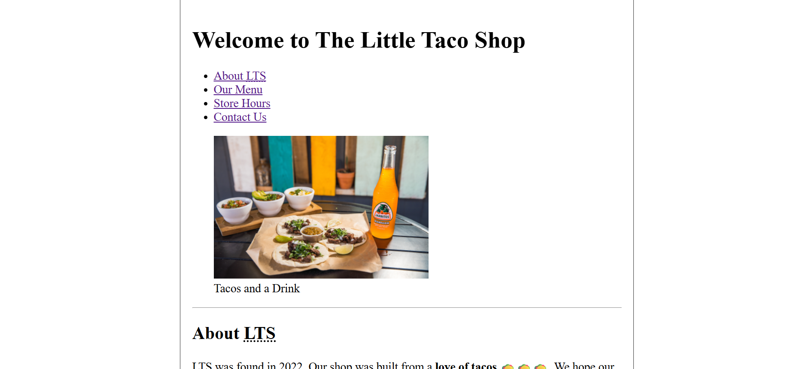
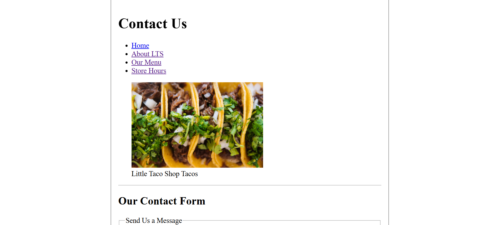
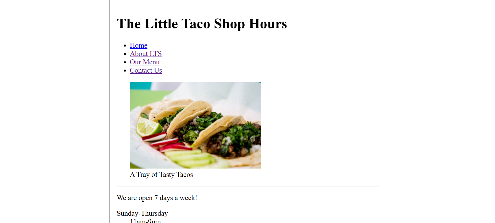

# 📁 The Little Taco Shop

## ℹ️ A basic HTML taco shop website

  
  
  

A HTML website built with minimal CSS as part of my earliest challenge assignments in frontend development.

---

## 🔍 Overview

This project includes two additional HTML pages linked from the index page. At the time, I had been studying HTML for a couple of weeks while coding it manually and I was confident that I could do this challenge.

However, even the simplest challenge humbled me and I found myself stuck and reviewing the lessons again until I finally completed it on my own. Here's the skills I used in this challenge:

- Correct usage of varied HTML5 elements.
- Polished my skills in building a skeleton website
- Building tables and forms in HTML from scratch
- Translating the [design examples](./examples/) to code

---

## ✨ Features

- Multi-page website with internal linking
- Semantic HTML5 structure
- Clean and readable data table
- Use of emojis for website flair
- Simple contact form that submits data to [httpbin.org](https://httpbin.org/get) for testing purposes

---

## 🧠 What I Learned

This was my first hand experience of being given design images and a task of replicating it through code. Here's what I learned:

- KEEP PRACTICING - You will be surprised how humbling simple things can be even with HTML
- Having a clear thought of how you code a section is a must
- Write each code with intent in mind so as to not lose focus
- That the end is rewarding if you finished it all on your own

---

## 🛠️ Tech Used

- HTML5
- CSS3

---

## 🚀 How to Run

1. Clone the repository
2. Navigate to this folder
3. Open `index.html` in your browser

---

## 🌐 Live Demo

Or you can check out the 👉 [live website here](https://my-little-taco-shop.netlify.app/)

---

## 🧑‍💻 Author

Created by **Elmar Chavez**

🗓️ Month/Year: **April 2025**

📚 Journey: **First month** of learning _frontend web development_.
